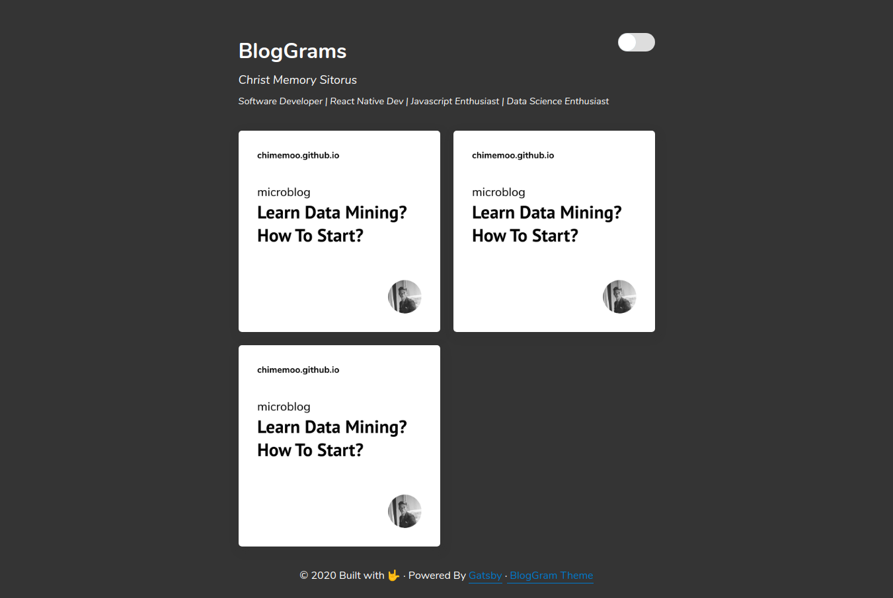
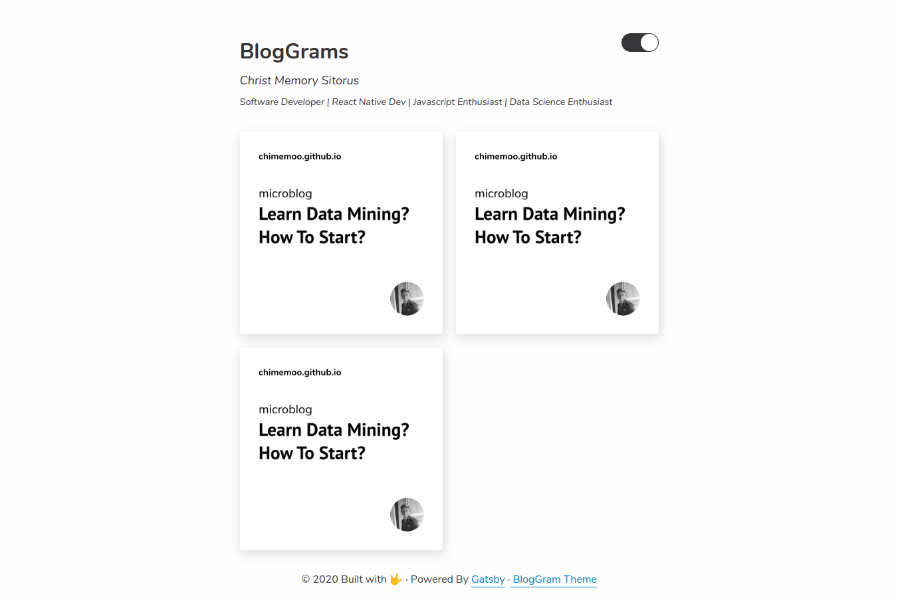
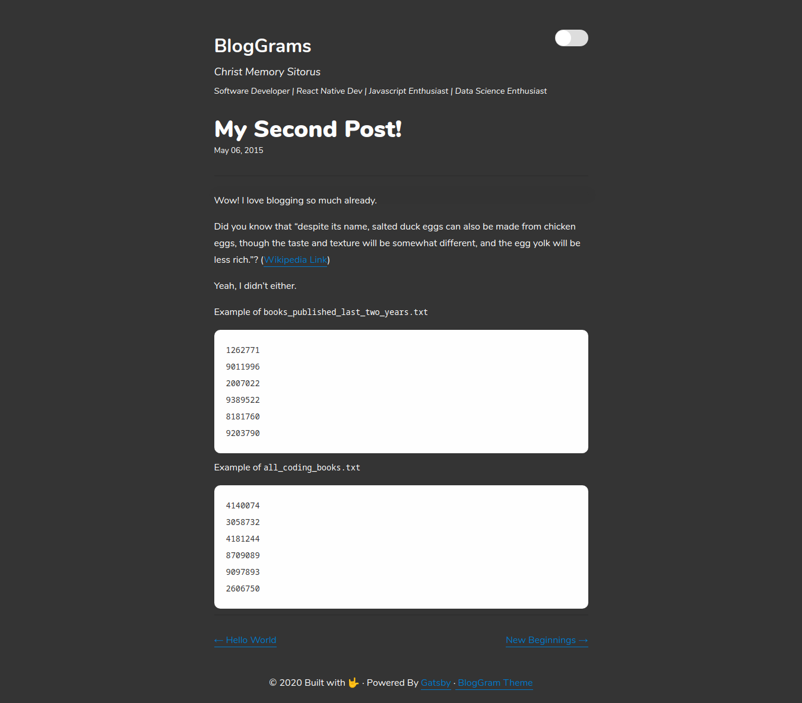
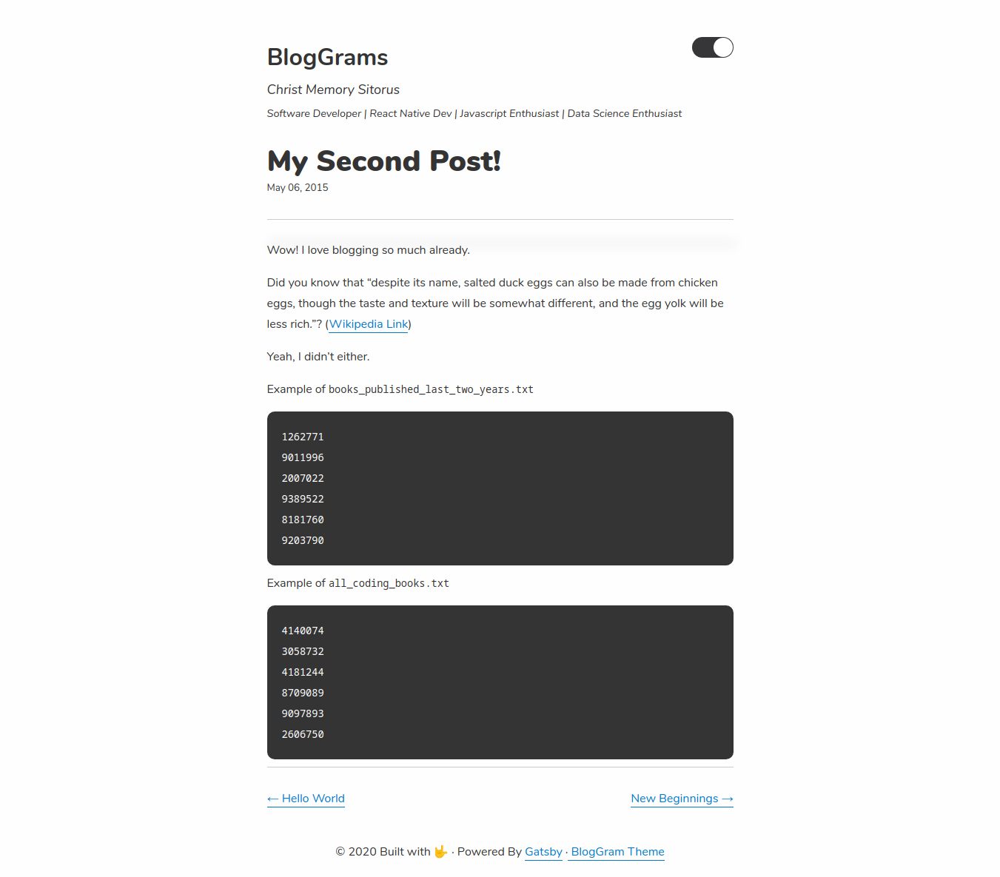

<!-- AUTO-GENERATED-CONTENT:START (STARTER) -->
<h1 align="center">
  Gatsby's Blog Gram  Theme 📷
</h1>

This is theme build from gatsby starter blog. This theme inspired by microblog that exist in instagram. 

## 🔨 Feature
Added Feature from gatsby starter blog :
1. Image Post
2. Image Slider (On blog post)
3. Dark/Light Theme

Feature to add :
1. Continuous scroll at Home Page
<br><br>
## 🚀 Quick start

1.  **Create a Gatsby site.**

    Use the Gatsby CLI to create a new site, specifying the blog starter.

    ```shell
    # create a new Gatsby site using the blog starter
    gatsby new blog-gram https://github.com/chimemoo/gatsby-blog-gram-theme
    ```

1.  **Start developing.**

    Navigate into your new site’s directory and start it up.

    ```shell
    cd my-blog-gram/
    gatsby develop
    ```

1.  **Open the source code and start editing!**

    Your site is now running at `http://localhost:8000`!

    _Note: You'll also see a second link: _`http://localhost:8000/___graphql`_. This is a tool you can use to experiment with querying your data. Learn more about using this tool in the [Gatsby tutorial](https://www.gatsbyjs.org/tutorial/part-five/#introducing-graphiql)._

    Open the `blog-gram` directory in your code editor of choice and edit `src/pages/index.js`. Save your changes and the browser will update in real time!


## 📷 Screenshoot : 






<!-- AUTO-GENERATED-CONTENT:END -->
